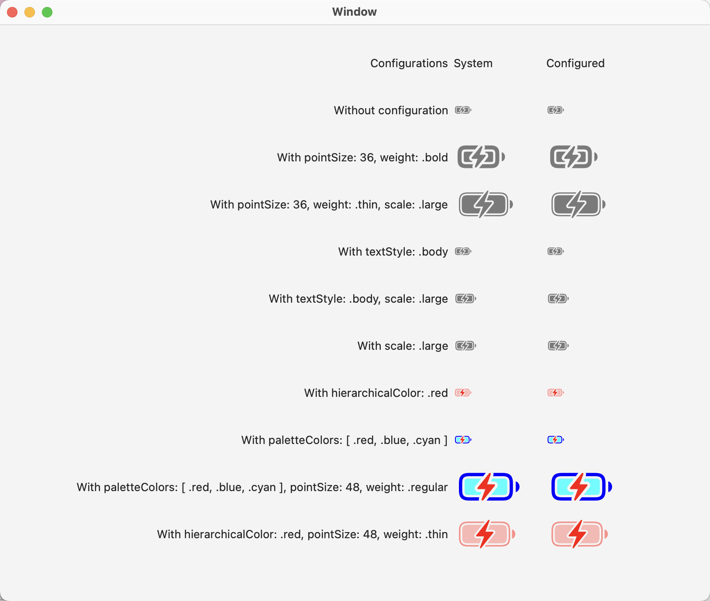
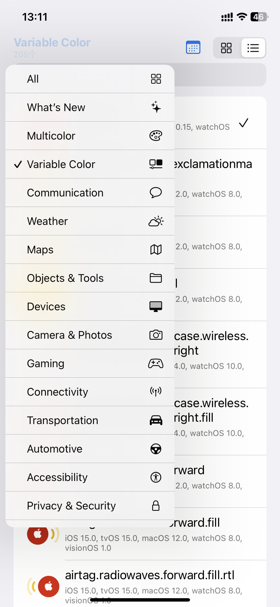
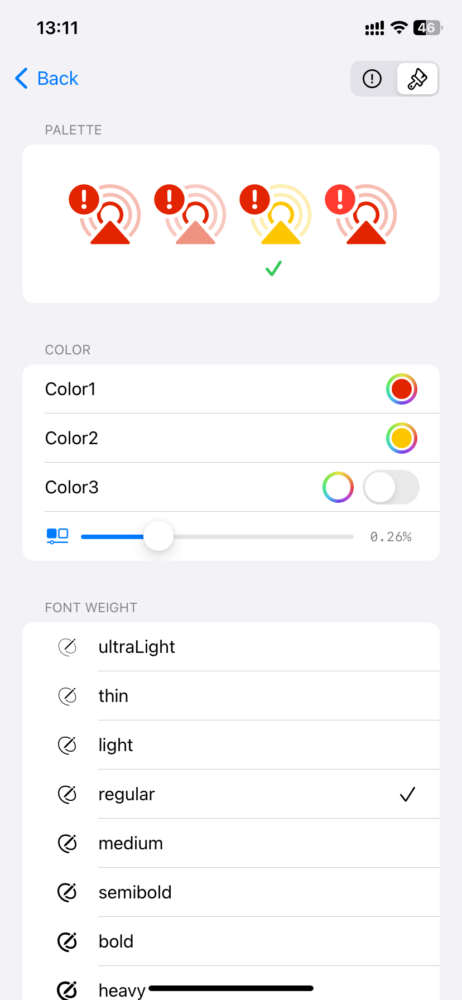

# SFSymbols

## 1. 说明

### 1.1 概述

苹果的SF符号辅助项目，统计了所有的符号和相关的信息，将所有的符号使用枚举与常量的方式提供给使用者，如下：

```
/// - SFName

public enum SFName: String, Identifiable {

    public var id: String {
        self.rawValue
    }

    /// Support only iOS 13.0, macOS 10.15, tvOS 13.0, watchOS 6.0, visionOS 1.0 and later
    ///
    /// - Symbol Name: 0.circle
    /// - Category: indices
    ///
    /// Availabilities:
    /// - hierarchical: iOS 15.0, macOS 12.0, tvOS 15.0, watchOS 8.0, visionOS 1.0
    @available(iOS 13.0, macOS 10.15, tvOS 13.0, watchOS 6.0, visionOS 1.0, *)
    case _0Circle = "0.circle"

    ......
}

/// - sFSymbol

/// Support only iOS 15.4, macOS 12.3, tvOS 15.4, watchOS 8.5, visionOS 1.0 and later
///
/// - Symbol Name: camera.macro.circle
/// - Category: cameraandphotos, nature
///
/// Availabilities:
/// - hierarchical: iOS 15.4, macOS 12.3, tvOS 15.4, watchOS 8.5, visionOS 1.0
static let cameraMacroCircle = SFSymbol(.cameraMacroCircle, releaseYear: ._2021_3, category: [ .cameraandphotos, .nature ], keywords: ["macro"], layerset: [.hierarchical: ._2021_3])
```

在每个符合常量或者枚举值对应的注释信息中都包含了如下内容：
1. 支持版本
2. 符号名称
3. 符号分类
4. 支持的样式
5. 等等...

### 1.2 命名方式

因为代码语言和字符串的区别，所以为了使用和对应，会去掉符号中的所有`.`，然后将所有单词以驼峰命名法的方式拼接起来，如果首字母是数字，那么会额外的拼接上`_`，因为数字不可以作为代码的起始字符，如下：
```
0.circle -> _0Circle
arrow.uturn.left.circle.badge.ellipsis -> arrowUturnLeftCircleBadgeEllipsis
dots.and.line.vertical.and.cursorarrow.rectangle -> dotsAndLineVerticalAndCursorarrowRectangle
```

### 1.3 注意点

因为SF符号基本上每年都会更新，新更新的符号无法在旧版本上使用；而且每次更新有的被废弃、有的被重命名，所以在使用上会有一定的注意的地方：

1. 符号枚举
因为上述的原因，所以不会提供`CaseIterable`协议的支持；

2. 符号常量
因为SF符号基本每年都会有优化和发布，所以在实现的时候，把所有符号按年分组，分别记录在不同的文件中。
同时，为每个符号添加了系统版本的限定，如果你在的项目支持高版本，那么对于低版本的符号代码，你是打不出来的，这可以避免使用到一些无法再低版本上使用的符号，如：
```
@available(iOS 15.1, macOS 12.0, tvOS 15.1, watchOS 8.1, visionOS 1.0, *)
public extension SFSymbol {
    /// Support only iOS 15.1, macOS 12.0, tvOS 15.1, watchOS 8.1, visionOS 1.0 and later
    ///
    /// - Symbol Name: bolt.ring.closed
    ///
    /// Availabilities:
    /// - hierarchical: iOS 15.1, macOS 12.0, tvOS 15.1, watchOS 8.1, visionOS 1.0
    static let boltRingClosed = SFSymbol(.boltRingClosed, releaseYear: ._2021_1, keywords: ["energy", "power"], layerset: [.hierarchical: ._2021_1])
}
```


## 2. Useage



### 2.1 直接加载符号图片

```
NSImage(sfname: .checkmark)
NSImage(sfsymbol: .checkmark)
NSImage(sfsymbol: .checklist.applying(hierarchicalColor: .red).applying(pointSize: 48, weight: .thin))

UIImage(sfname: .checkmark)
UIImage(sfsymbol: .checkmark)
UIImage(sfsymbol: .checklist.applying(hierarchicalColor: .red).applying(pointSize: 48, weight: .thin))

Image(sfname: .checkmark)
Image(sfsymbol: .checkmark)
```

### 2.2 符号的遍历

在SFSymbols里记录了所有的符号信息，可以按所需要的数据类型进行筛选。
```
public let symbols: [SFSymbol]
public let symbolsMap: [SFName: SFSymbol]
public let activeCategories: [SFSymbol.Category]
public let categorieToSymbols: [SFSymbol.Category: [SFSymbol]]
public let releaseToSymbols: [SFSymbol.ReleaseYear: [SFSymbol]]
```

## 3. Symbol查看

`Viewer`目录下是相关源码。

<details>
<summary>
适配的各端应用的截图。
</summary>

1. macOS


2. iPad

|  |  |
|--|--|
|  |  |
|  |  |
|  |  |

3. iPhone / 竖向显示

| | | |
|--|--|--|
|  |  |  |
|  |  |  |

4. iPhone / 横向显示

| | |
|--|--|
|  |  |
|  |  |
|  |  |

</details>